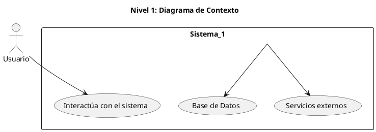
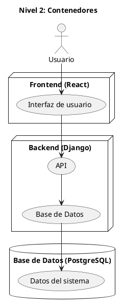

# La Programación Orientada a Objetos

La (POO) es un paradigma fundamental en el desarrollo de software que permite organizar el código en torno a objetos que representan entidades del mundo real.

## Fundamentos de la POO

La POO construye la programación segun los siguientes elementos

- **Clases:** son modelos que definen las características y comportamientos de un tipo de objeto.
- **Objetos:** Son instancias (un objeto creado a partir de una clase) de clases que contienen datos y métodos.
- **Atributos:** hay dos tipos: 1. las variables que pertenecen a la clase y son compartidos por todas las instancias, mientras que 2. los atributos de instancia (Objetos) son únicos para cada instancia (Objeto)
- **Métodos:** Estos son Funciones (Acciones) que un objeto(instancia) puede realizar.

```python
# Definimos la clase Personaje
class Personaje:
    # Atributo compartido por todas las instancias
    Pais = "Venezuela"

    def __init__(self, nombre, etnia, nivel_estudio):
        # Atributos de instancia
        self.nombre = nombre
        self.etnia = etnia
        self.nivel_estudio = nivel_estudio

    # Método para mostrar información del personaje
    def presentar(self):
        return f"Soy {self.nombre}, un {self.etnia} con un nivel de estudio {self.nivel_estudio}, del Pais de {Personaje.Pais}."

# Creamos objetos (instancias) de la clase Personaje
personaje1 = Personaje("Nebraske", "Pemon", "Universitario")
personaje2 = Personaje("Guillermo", "Yanomami", "Universitario")

# Ejecutamos métodos de las instancias
print(personaje1.presentar())
print(personaje2.presentar())
```

La POO se basa en cuatro principios fundamentales:

- **Encapsulación:** Protege los datos dentro de una clase y solo permite su modificación a través de métodos específicos.

```python
class Personaje:
    def __init__(self, nombre, raza, nivel):
        self.nombre = nombre
        self.raza = raza
        self.__nivel = nivel  # Atributo privado (encapsulado)

    def obtener_nivel(self):  # Método para acceder al nivel
        return self.__nivel

    def subir_nivel(self):  # Método para modificar el nivel de manera controlada
        self.__nivel += 1
        return f"{self.nombre} ha subido al nivel {self.__nivel}."

# Creando un personaje
personaje1 = Personaje("Vaelith", "Elfo oscuro", 5)

# Intentando acceder directamente al atributo privado (esto daría error)
# print(personaje1.__nivel)  # ❌ Esto no funciona

# Usamos el método seguro
print(personaje1.obtener_nivel())  # ✅ Esto sí funciona
```

- **Herencia:** Permite que una clase derive de otra, heredando sus atributos y métodos.

```python
class Personaje:
    def __init__(self, nombre, raza):
        self.nombre = nombre
        self.raza = raza

    def presentar(self):
        return f"Soy {self.nombre}, un {self.raza}."

# Clase hija que hereda de Personaje
class Mago(Personaje):
    def __init__(self, nombre, raza, poder_magico):
        super().__init__(nombre, raza)
        self.poder_magico = poder_magico

    def lanzar_hechizo(self):
        return f"{self.nombre} lanza un hechizo de {self.poder_magico}."

# Creando un mago
mago1 = Mago("Vaelith", "Elfo oscuro", "fuego arcano")

print(mago1.presentar())  # Hereda el método de Personaje
print(mago1.lanzar_hechizo())  # Método propio de Mago

```

- **Polimorfismo:** Facilita que diferentes clases puedan ejecutar el mismo método de manera diferenciada.

```python
class Guerrero(Personaje):
    def presentar(self):
        return f"{self.nombre}, el feroz guerrero de {self.raza}, está listo para la batalla."

class Mago(Personaje):
    def presentar(self):
        return f"{self.nombre}, el sabio mago de {self.raza}, domina las artes arcanas."

# Creamos instancias
guerrero = Guerrero("Ragnar", "Humano")
mago = Mago("Vaelith", "Elfo oscuro")

# Llamamos al mismo método en ambas clases, pero con diferente resultado
print(guerrero.presentar())  # Guerrero tiene una presentación más agresiva
print(mago.presentar())  # Mago tiene una presentación más intelectual

```

- **Abstracción:** Oculta detalles internos y permite definir estructuras generales.

```python
from abc import ABC, abstractmethod

class PersonajeBase(ABC):
    def __init__(self, nombre, raza):
        self.nombre = nombre
        self.raza = raza

    @abstractmethod
    def habilidad_especial(self):
        pass  # Este método **debe** ser implementado en las subclases

class Mago(PersonajeBase):
    def habilidad_especial(self):
        return f"{self.nombre} invoca una tormenta mágica."

class Guerrero(PersonajeBase):
    def habilidad_especial(self):
        return f"{self.nombre} desata un golpe devastador."

mago = Mago("Vaelith", "Elfo oscuro")
guerrero = Guerrero("Ragnar", "Humano")

print(mago.habilidad_especial())  # 🧙‍♂️ Magia
print(guerrero.habilidad_especial())  # ⚔️ Fuerza bruta

```

## Técnicas y Herramientas para la representación de la POO en UML - diagrama de clase y sus relaciones

## ¿Sigue siendo relevante UML?

Sí, pero con matices. UML sigue siendo útil para:

- Diseño de sistemas complejos, especialmente en grandes equipos.
- Comunicación entre desarrolladores y stakeholders sin necesidad de código.
- Documentación estructurada, aunque ahora se usa de manera más ligera.

Sin embargo, en metodologías ágiles, se prefiere:

Diagramas más simples y dinámicos, como los de:

- C4 Model.

Herramientas de modelado más interactivas, como:

- PlantUML o Draw.io.

Prototipado rápido, donde el código y pruebas reemplazan diagramas detallados.

### Alternativas más eficientes

Si buscas algo más moderno, aquí tienes algunas opciones:

- C4 Model: Un enfoque más ágil para visualizar arquitecturas de software.

- Domain-Driven Design (DDD): Modelado basado en el negocio y la lógica de dominio.

- Diagrama de flujo de eventos: Más útil en sistemas distribuidos y microservicios.

En resumen, UML no ha desaparecido, pero ha sido adaptado para ser más flexible y menos burocrático.

### Ejemplos



📌 **Explicación**:

- El usuario interactúa con el sistema.
- El sistema se conecta con una base de datos y servicios externos.
- Este es **Nivel 1 (Contexto)** del **C4 Model**.

---

```md


📌 **Aquí el modelo representa**:

- Un **frontend** en React.
- Un **backend** en Django con una API.
- Una **base de datos** en PostgreSQL.

---
